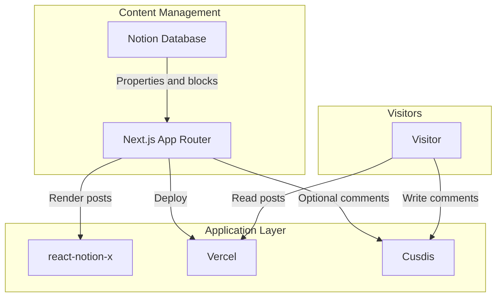
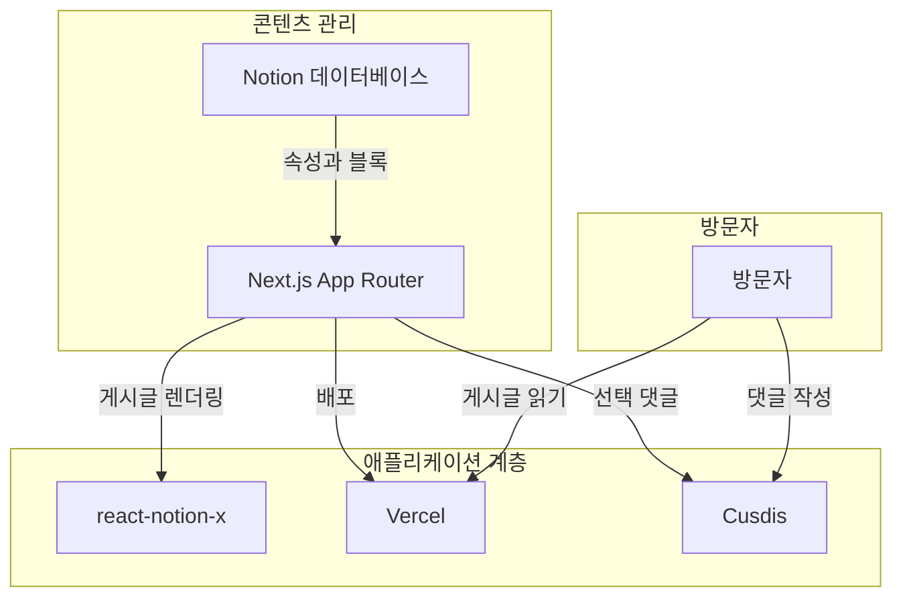

# Phase 6: Documentation - Pattern Map

**Mapped:** 2026-07-29
**Files analyzed:** 2 (both modified, no new files)
**Analogs found:** 2 / 2 (self-referential — each file's existing Cusdis section is the analog for its own new section)

## File Classification

| New/Modified File | Role | Data Flow | Closest Analog | Match Quality |
|--------------------|------|-----------|-----------------|----------------|
| `README.md` (new `## Email Notifications (Optional)` section + diagram/table/list updates) | documentation (English) | transform (prose describing shipped behavior) | `README.md` itself — existing Cusdis documentation pattern (diagram node, Core Services row, Features bullet, env var note) | exact — same file, same document conventions |
| `README_KR.md` (Korean equivalent) | documentation (Korean) | transform | `README_KR.md` itself — existing Cusdis documentation pattern (Korean equivalents) | exact — same file, same conventions, 1:1 parity with README.md |

No application code files are created or modified in this phase. Both files are edited, not created — the "analog" here is intra-file precedent rather than a different file in the repo.

## Pattern Assignments

### `README.md` — new `## Email Notifications (Optional)` section

**Analog:** `README.md`'s own existing Cusdis-related passages (four locations)

**1. Diagram node pattern** (lines 26-42, existing mermaid block):

Convention to copy: `subgraph "Title Case Name"` blocks; nodes as `Letter[Label]`; edges labeled with `-->|Action phrase|`. Per CONTEXT.md D-11, the new content becomes its own `subgraph "Notifications"` (not folded into "Application Layer"), following the exact same node/edge-label style. RESEARCH.md's recommended addition (verbatim, to insert after the "Application Layer" subgraph, before "Visitors"):
```mermaid
    subgraph "Notifications"
        CR[Vercel Cron] -->|Daily trigger| NR[Notify Route]
        NR -->|Query unemailed posts| N
        NR -->|Send digest| RS[Resend]
        RS -->|Email new posts| SUB[Subscriber]
    end
```
Note the cross-subgraph edge into the existing `N[Notion Database]` node — this diagram already supports cross-subgraph references (no need to duplicate the Notion node).

**2. Core Services table row pattern** (lines 44-52):
```markdown
| Service            | Role      | Purpose |
| :----------------- | :-------- | :------ |
| **Notion**         | CMS       | Manage posts, metadata, categories, tags, and status. |
| **Next.js**        | Framework | Render the blog, metadata, sitemap, OpenGraph images, and search pages. |
| **Vercel**         | Hosting   | Deploy from a GitHub fork without operating a separate server. |
| **react-notion-x** | Renderer  | Render rich Notion blocks such as callouts, toggles, tables, and code blocks. |
| **Cusdis**         | Comments  | Optional embedded comment widget. |
```
Convention: `| **ServiceName** | RoleWord | One-sentence purpose. |` — bold service name, single-word role, terse purpose sentence ending in a period. A new `**Resend**` row (Role: `Email`, Purpose describing the optional digest) should append following this exact shape.

**3. Features bullet pattern** (lines 54-63):
```markdown
- **Notion CMS:** Manage posts directly in Notion.
...
- **Optional comments:** Cusdis comments expand with the page instead of adding a nested scroll area.
```
Convention: `- **Bold lead phrase:** One-sentence elaboration.` A new bullet (e.g., `- **Optional email digests:** ...`) should append at the end of this list, matching the "Optional comments" bullet's phrasing style (leads with "Optional").

**4. Environment Variables optional-var note pattern** (lines 76-84):
```markdown
## Environment Variables

\`\`\`bash
NOTION_TOKEN="ntn_your_notion_integration_token"
NOTION_DATABASE_ID="your_notion_database_id"
NEXT_PUBLIC_CUSDIS_APP_ID="your_cusdis_app_id"
\`\`\`

`NEXT_PUBLIC_CUSDIS_APP_ID` is optional. Leave it unset to disable the comment section entirely; set it to enable comments with your own Cusdis project.
```
Convention to copy for D-03's *separate* fenced block: placeholder values use the `"prefix_your_thing_here"` shape (`ntn_your_notion_integration_token`, `your_cusdis_app_id`); the prose sentence immediately following the block states, in one sentence, what leaving the var unset does and what setting it does ("Leave X unset to disable Y entirely; set it to enable Z"). Per D-03, the new section's own fenced block (4 vars: `RESEND_API_KEY`, `RESEND_AUDIENCE_ID`, `CRON_SECRET`, `NOTIFY_PHYSICAL_ADDRESS`) must NOT be merged into this existing block — this existing block stays exactly as-is (3 vars only).

**5. Vercel Deployment numbered-step pattern** (lines 65-74) — structural analog for the new section's step format:
```markdown
## Vercel Deployment

1. Fork this repository to your GitHub account.
2. Duplicate the [DataDashboard page](...) to your Notion workspace.
3. Create a Notion integration at [notion.so/my-integrations](...), then save the integration secret as `NOTION_TOKEN`.
4. On your duplicated database page, open `...` -> **Connections** and add the integration.
5. Turn on **Share to web** for the database page so `react-notion-x` can render page blocks.
6. Copy the database ID from the Notion database URL and save it as `NOTION_DATABASE_ID`.
7. Import your forked repository in Vercel.
8. Add the required environment variables in Vercel, then deploy.
```
Convention: flat numbered list (`1.` through `8.`), each step is an imperative sentence, inline links use `[label](url)` markdown syntax, env var names and UI labels are backtick-code or bold respectively (`` `NOTION_TOKEN` ``, `**Connections**`). The new `## Email Notifications (Optional)` section (placed immediately after this section per D-02) should reuse this exact numbered-step shape, with D-04/D-05/D-07's inline warnings added as bolded sentences within/after the relevant step (see RESEARCH.md's "Recommended Section Structure" for the full illustrative draft — not to be pasted verbatim, but structurally authoritative).

**Heading level:** `##` (H2), matching all sibling top-level sections — confirmed from the document's heading hierarchy (all major sections use `##`, none use `###` at the top level).

---

### `README_KR.md` — Korean equivalent section

**Analog:** `README_KR.md`'s own existing Cusdis-related passages (four locations, 1:1 positional parity with README.md)

**1. Diagram node pattern** (lines 26-42, Korean mermaid block):

Convention: subgraph titles and edge labels are translated to Korean; node bracket labels use Korean nouns where the English README uses English nouns (`Notion Database` → `Notion 데이터베이스`), but proper nouns/product names stay in English (`Next.js`, `react-notion-x`, `Vercel`, `Cusdis`). Per D-11 + RESEARCH.md's Open Question 2 recommendation, the new subgraph name `"알림"` (Notifications) parallels `"콘텐츠 관리"` / `"애플리케이션 계층"` / `"방문자"`. Product names (`Vercel Cron`, `Resend`) should stay in English per the existing convention of not translating proper nouns.

**2. Core Services (주요 서비스) table row pattern** (lines 44-52):
```markdown
| 서비스             | 역할      | 목적 |
| :----------------- | :-------- | :--- |
| **Notion**         | CMS       | 게시글, 메타데이터, 카테고리, 태그, 공개 상태를 관리합니다. |
...
| **Cusdis**         | 댓글      | 선택적으로 사용할 수 있는 임베드 댓글 위젯입니다. |
```
Convention: same bold-service-name / single-Korean-word-role / Korean sentence-ending-in-`-니다` purpose shape. New `**Resend**` row should follow (Role: e.g. `이메일`, Purpose ending in `-니다`).

**3. Features (주요 기능) bullet pattern** (lines 54-63):
```markdown
- **Notion CMS:** 게시글을 Notion에서 직접 작성하고 관리합니다.
...
- **선택 댓글:** Cusdis 댓글은 별도 중첩 스크롤 없이 페이지 높이에 맞춰 확장됩니다.
```
Convention: `- **한글 리드 문구:** 한 문장 설명 (-니다로 종결).` New bullet should follow this exact shape, mirroring the English "Optional email digests" bullet's meaning.

**4. Environment Variables (환경 변수) optional-var note pattern** (lines 76-84):
```markdown
## 환경 변수

\`\`\`bash
NOTION_TOKEN="ntn_your_notion_integration_token"
NOTION_DATABASE_ID="your_notion_database_id"
NEXT_PUBLIC_CUSDIS_APP_ID="your_cusdis_app_id"
\`\`\`

`NEXT_PUBLIC_CUSDIS_APP_ID`는 선택 사항입니다. 설정하지 않으면 댓글 섹션이 표시되지 않으며, 본인의 Cusdis 프로젝트를 사용하려면 값을 설정하세요.
```
Convention: identical placeholder values to the English file (env var *values* are never translated — only prose is); the explanatory sentence pattern is `` `VAR_NAME`는/은 선택 사항입니다. 설정하지 않으면 [consequence]; [enable condition]. `` This existing block stays untouched per D-03; the new section gets its own separate Korean fenced block with the same 4 vars (placeholder values identical to the English file — env var placeholder text is not translated).

**5. Vercel 배포 numbered-step pattern** (lines 65-74):
```markdown
## Vercel 배포

1. 이 저장소를 본인의 GitHub 계정으로 fork합니다.
2. [DataDashboard 페이지](...)를 Notion 워크스페이스로 복제합니다.
3. [Notion Integrations](...)에서 새 integration을 만들고 secret 값을 `NOTION_TOKEN`으로 저장합니다.
4. 복제한 데이터베이스 페이지에서 `...` -> **Connections**를 열고 integration을 연결합니다.
...
8. Vercel 환경 변수에 필요한 값을 추가한 뒤 배포합니다.
```
Convention: numbered list, each step ends in `-합니다`/`-니다` polite present tense; UI labels stay in English bolded (`**Connections**`, `**Share to web**`) matching what the forker literally sees in Notion's UI (this directly supports RESEARCH.md Open Question 2's recommendation to keep "Update content" in English within the Korean prose). The new `## 이메일 알림 (선택)` section (exact Korean heading wording is Claude's Discretion per CONTEXT.md, but should follow this `(선택)` parenthetical pattern mirroring `README.md`'s `(Optional)`) goes immediately after this section, same position as the English file (D-02 parity).

**Heading level:** `##` (H2), matching README.md's heading level for structural parity.

---

## Shared Patterns

### English/Korean structural parity
**Source:** Both files' identical heading order (`# NoLog` → cross-link → intro → `## Core Library (SDK)` → `## How It Works` → `## Core Services` → `## Features` → `## Vercel Deployment` → `## Environment Variables` → `## Local Development` → `## Configuration` → `## Templates`)
**Apply to:** Both new sections — must be inserted at the exact same relative position (between "Vercel Deployment"/"Vercel 배포" and "Environment Variables"/"환경 변수") in both files, per CONTEXT.md D-02.

### Optional-feature four-touchpoint pattern (Cusdis precedent)
**Source:** `README.md` lines 35, 52, 63, 84 (and README_KR.md's equivalents at lines 35, 52, 63, 84)
**Apply to:** The email feature must touch all four of: (1) diagram node/subgraph, (2) Core Services table row, (3) Features bullet, (4) an env-var-adjacent optional note — though per D-03, touchpoint (4) is a NEW self-contained fenced block in the new section rather than an addition to the existing "Environment Variables" block (this is the one deliberate divergence from the Cusdis precedent, called out explicitly in RESEARCH.md).

### Placeholder-value convention for fenced env var blocks
**Source:** `README.md`/`README_KR.md` lines 78-81 — `"ntn_your_notion_integration_token"`, `"your_notion_database_id"`, `"your_cusdis_app_id"`
**Apply to:** The new section's 4-var fenced block — use the same `"prefix_your_thing_here"` placeholder shape (e.g. `"re_your_resend_api_key"`), never a real secret value (security note from RESEARCH.md's Security Domain section).

### Inline link markdown convention
**Source:** `README.md` line 68-69 — `` [DataDashboard page](https://...) ``, `` [notion.so/my-integrations](https://...) ``
**Apply to:** D-08's Resend documentation links and D-09's pricing page link — same `[label](url)` inline style, not a bare URL or a "See: <url>" footnote style.

## No Analog Found

None. Both target files already contain a directly analogous optional-feature documentation pattern (Cusdis) at every touchpoint this phase needs to extend. No file lacks a precedent to follow.

## Metadata

**Analog search scope:** `README.md`, `README_KR.md` (repo root) — read in full, no other files searched since CONTEXT.md explicitly names these two existing README passages as the required analog source.
**Files scanned:** 2
**Pattern extraction date:** 2026-07-29
