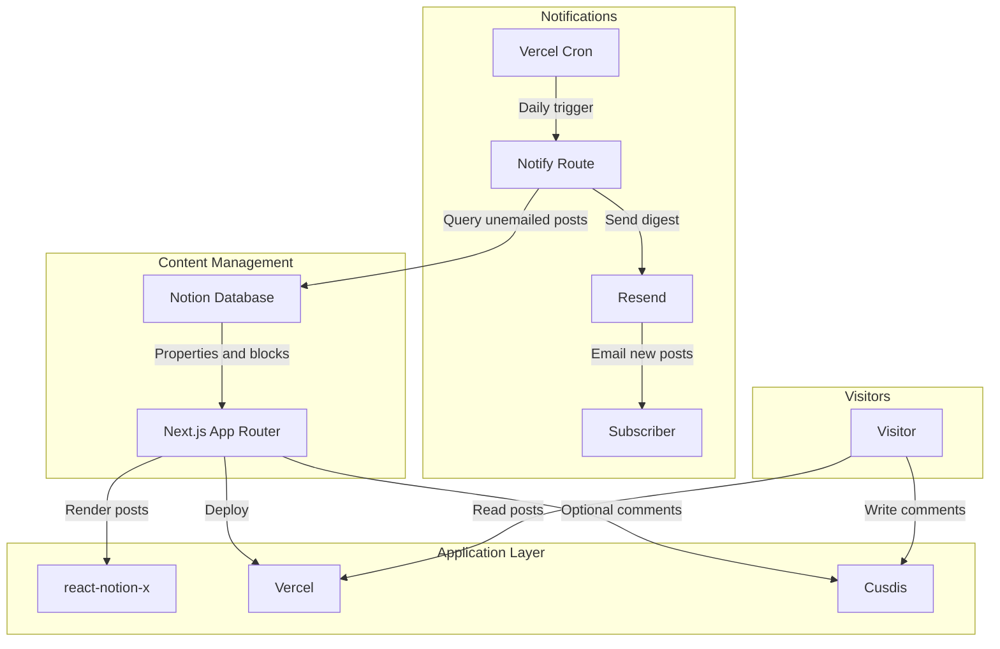

# Phase 6: Documentation - Research

**Researched:** 2026-07-29
**Domain:** Technical documentation (README.md/README_KR.md) for an env-var-gated email subscription feature — no application code
**Confidence:** HIGH

<user_constraints>
## User Constraints (from CONTEXT.md)

### Locked Decisions

- **D-01:** The email feature gets a **new, dedicated section** in both README files — `## Email Notifications (Optional)` (English) / the equivalent Korean heading in `README_KR.md` — rather than being folded into the existing "Vercel Deployment" numbered steps or "Environment Variables" fenced block the way `NEXT_PUBLIC_CUSDIS_APP_ID` is handled today.
- **D-02:** The new section is placed **immediately after "Vercel Deployment"**, before "Environment Variables".
- **D-03:** The email feature's env vars (`RESEND_API_KEY`, `RESEND_AUDIENCE_ID`, `CRON_SECRET`, `NOTIFY_PHYSICAL_ADDRESS`) get their **own fenced code block inside the new section**, not merged into the existing "Environment Variables" block.
- **D-04:** Known failure traps (Notion "Update content" capability, Resend quota confusion, cron UTC/Production-only behavior) are documented as **inline warnings at the exact setup step they apply to**, not collected into a separate "Troubleshooting" subsection.
- **D-05:** The Notion "Update content" capability grant is documented as its **own explicit step**, clearly distinguished from the existing step 4 ("Connections" → add integration to the database). Must state the consequence of skipping it: `markEmailed()` fails with a 403 — new subscribers get the same post emailed to them repeatedly on every cron run since the post is never marked sent.
- **D-06:** The `emailed` Notion property instructions state the **exact property name and type** — `emailed`, Checkbox — and explicitly warn that the name must match exactly (case-sensitive) or `NologClient` throws `MissingEmailedPropertyError`.
- **D-07:** The UTC-only / Production-deployment-only cron behavior (DOCS-03) is documented as an **inline note near wherever the cron schedule is described** in the new section. Reference that the shipped default (`0 11 * * *` in `vercel.json`) targets 8 PM KST and point forkers at `vercel.json`'s `schedule` field to change it for their own audience's timezone.
- **D-08:** Resend account creation and domain/SPF/DKIM verification are documented as a **numbered step-by-step summary that links out to Resend's own domain-verification documentation** for the exact click path — not a full screenshot-level walkthrough, and not a one-line mention with only an external link.
- **D-09:** The Resend free-tier quota line states **both figures explicitly** — the correct Broadcast/Audience quota this feature actually uses (up to 1,000 contacts/month) — **and** an explicit disambiguation that this is different from the 100/day transactional Send API cap, which does not apply here.
- **D-10:** Both the mermaid architecture diagram and the "Core Services"/"Features" tables in both README files are **updated** to reflect the email feature, not left as pre-feature snapshots.
- **D-11:** The diagram change adds a **new, separate `Notifications` subgraph** (`Vercel Cron -> Notify Route -> Resend -> Subscriber`), parallel to the existing "Content Management"/"Application Layer"/"Visitors" subgraphs — not a node added into the existing "Application Layer" subgraph.

### Claude's Discretion

- Exact English/Korean wording for the new section's heading, step text, and warning callouts beyond what D-01 through D-11 fix.
- Exact Resend documentation URL(s) to link for D-08 (domain/SPF/DKIM verification) and D-09 (pricing/quota page) — use Resend's current official docs, verified live rather than assumed. **Resolved below in Sources — both verified live this session.**
- Exact mermaid node/edge labels and styling for the new `Notifications` subgraph (D-11) — follow the existing diagram's label conventions (e.g., action-labeled edges like `-->|Deploy|`).
- Whether the new "Email Notifications (Optional)" section uses numbered steps (matching "Vercel Deployment") or a mixed steps+subsections format — planner's call.
- Exact wording of the Notion "Update content" capability step (D-05) and its failure-consequence warning — follow the project's existing warning-tone conventions.

### Deferred Ideas (OUT OF SCOPE)

None raised during this discussion — all four areas stayed within Phase 6's documentation boundary. No scope creep occurred.

</user_constraints>

<phase_requirements>
## Phase Requirements

| ID | Description | Research Support |
|----|-------------|------------------|
| DOCS-01 | README.md and README_KR.md document the new env vars (`RESEND_API_KEY`, `RESEND_AUDIENCE_ID`, `CRON_SECRET`), the `emailed` Notion property, and the Notion "Update content" capability grant as its own explicit setup step, separate from setting env vars | Ground-truth env var list confirmed in Code Examples section (route.ts reads 4 vars, not 3 — see Pitfall/Correction note below); exact `emailed`/Checkbox contract and `MissingEmailedPropertyError`/`NotionCapabilityError` message text extracted from `packages/core/src/client.ts`; Notion capability name (`Update content`) confirmed live against `developers.notion.com/reference/capabilities` |
| DOCS-02 | README.md and README_KR.md document Resend domain/SPF/DKIM verification as a mandatory setup step, and state the correct Broadcast/Audience quota (up to 1,000 contacts/month) rather than the transactional Send API cap | Both Resend URLs (domain verification, pricing/quota) verified live this session (not assumed) — see Sources; exact quota figures and the "broadcasts can only be sent to existing contacts" framing quoted verbatim below |
| DOCS-03 | README.md and README_KR.md state that the cron only fires on Production deployments and is evaluated in UTC | Confirmed live against `vercel.com/docs/cron-jobs`; ground truth for the default schedule (`0 11 * * *`) confirmed by direct read of `apps/web/vercel.json` |

</phase_requirements>

## Summary

This is a documentation-only phase: no application code changes, no new packages, no config changes. The entire deliverable is prose and a diagram/table update across two Markdown files (`README.md`, `README_KR.md`) that already exist and have an established structure. The research task was therefore not "find a stack" but "verify every fact the docs will assert" — env var names, Notion property contract, error message text, Resend's current quota/verification documentation URLs, and Vercel Cron's Production/UTC behavior — directly against the codebase and against live official documentation, per CONTEXT.md's explicit instruction not to rely on training-data memory for the Resend URLs or quota figures (this project's own `PITFALLS.md` Pitfall 1 documents a prior instance of exactly this kind of conflation).

**One ground-truth correction to CONTEXT.md/DOCS-01's literal wording:** DOCS-01 and CONTEXT.md's summary text name three env vars (`RESEND_API_KEY`, `RESEND_AUDIENCE_ID`, `CRON_SECRET`). Direct inspection of `apps/web/src/app/api/notify-subscribers/route.ts` (lines 210–231) shows the notify route's fail-closed gate actually checks **four** env vars: those three plus `NOTIFY_PHYSICAL_ADDRESS`. CONTEXT.md's own `<decisions>` D-03 and `<canonical_refs>` sections already correctly list all four — this is a requirement-summary omission, not a contradiction of a locked decision. The planner should document all four in the new fenced code block; omitting `NOTIFY_PHYSICAL_ADDRESS` would leave the digest failing closed with the operator log `[Notify] Route called while unconfigured — missing: NOTIFY_PHYSICAL_ADDRESS` and no README explanation of why.

**Primary recommendation:** Write the new `## Email Notifications (Optional)` section as an ordered checklist mirroring "Vercel Deployment"'s numbered-step format (per the existing repo convention), with D-04/D-05/D-07's warnings rendered as bolded inline callouts directly under the step they apply to (not blockquotes or a separate admonition component — the repo has no such component today), and cite the two Resend URLs verified live below rather than any URL recalled from training data.

## Architectural Responsibility Map

This phase has no runtime architecture — it is Markdown authored to describe an architecture already built in Phases 1–5. The map below records which *documentation surface* is responsible for describing which *already-implemented* runtime capability, so the plan doesn't misattribute a capability to the wrong file/section.

| Capability | Primary Tier | Secondary Tier | Rationale |
|------------|-------------|----------------|-----------|
| Env var setup instructions | Documentation (README fenced code block, D-03) | — | Purely descriptive; the actual fail-closed gate lives in `route.ts`, already shipped |
| Notion schema setup (`emailed` property) | Documentation (README step, D-06) | — | Describes a one-time manual Notion dashboard action; no code enforces the property's existence beyond throwing `MissingEmailedPropertyError` if absent |
| Notion capability grant | Documentation (README step, D-05) | — | Describes a one-time manual Notion Developer Portal action; `NotionCapabilityError` in `client.ts` is the only code-side signal, already shipped |
| Resend domain verification | Documentation (README step, D-08) | External (Resend dashboard) | The verification itself happens entirely in Resend's UI/DNS; README's job is only to link and mandate it |
| Resend quota disambiguation | Documentation (README note, D-09) | External (Resend pricing page) | Pure informational content; no code path in this repo enforces or checks quota |
| Cron Production/UTC behavior | Documentation (README note, D-07) | Deployment config (`vercel.json`, already shipped) | `vercel.json`'s `schedule` field is the actual mechanism; README's job is to explain its behavior and point forkers at that field to change it |
| Diagram/table consistency (D-10/D-11) | Documentation (README structural elements) | — | Purely representational; must stay visually/structurally consistent with the existing Cusdis precedent already in both files |

## Standard Stack

**Not applicable — no stack decisions in this phase.** No new libraries, frameworks, or packages are introduced. The only "stack" is Markdown + Mermaid, both already in use in `README.md`/`README_KR.md`.

### Alternatives Considered

| Instead of | Could Use | Tradeoff |
|------------|-----------|----------|
| Inline prose warnings (D-04) | A dedicated "Troubleshooting" section | Already rejected by CONTEXT.md D-04 — not re-litigated here |
| A new standalone doc file (like `TEMPLATE_GUIDE.md`) | Inline README section (D-01) | Already rejected by CONTEXT.md D-01 — email feature docs stay inline, unlike the Template Guide precedent |

## Package Legitimacy Audit

**Not applicable — this phase installs no packages.** No `package.json` changes, no new dependencies. The Package Legitimacy Gate is skipped per its own trigger condition ("every phase that installs external packages").

## Architecture Patterns

### Existing README Structural Pattern (the precedent this phase extends)

Both README files currently follow this heading order (confirmed by direct read of both files in full):

```
# NoLog
[cross-link to other language version]
[intro paragraph]
## Core Library (SDK)
## How It Works           <- mermaid diagram lives here
## Core Services          <- table: Service | Role | Purpose
## Features               <- bullet list
## Vercel Deployment       <- numbered steps 1-8
## Environment Variables   <- fenced bash block + one optional-var note
## Local Development
## Configuration
## Templates
```

Per D-02, the new `## Email Notifications (Optional)` section is inserted **between "Vercel Deployment" and "Environment Variables"**. The existing "Environment Variables" fenced block (3 vars: `NOTION_TOKEN`, `NOTION_DATABASE_ID`, `NEXT_PUBLIC_CUSDIS_APP_ID`) stays untouched per D-03 — the new section's own fenced block holds the 4 notify-side vars.

### Existing Optional-Feature Documentation Pattern (Cusdis precedent, D-10/D-11 extend this)

Cusdis — the only other optional, env-gated feature already documented — appears in exactly three places, confirmed by direct read:
1. **Diagram:** `V -->|Optional comments| C[Cusdis]` inside the `"Application Layer"` subgraph.
2. **Core Services table:** one row — `| **Cusdis** | Comments | Optional embedded comment widget. |`.
3. **Features list:** one bullet — `- **Optional comments:** Cusdis comments expand with the page instead of adding a nested scroll area.`
4. **Environment Variables section:** `NEXT_PUBLIC_CUSDIS_APP_ID` in the fenced block plus one sentence: `` `NEXT_PUBLIC_CUSDIS_APP_ID` is optional. Leave it unset to disable the comment section entirely; set it to enable comments with your own Cusdis project. ``

D-10/D-11 extend items 1–3 of this exact pattern to the email feature (a new `Notifications` subgraph rather than a node in `Application Layer`, per D-11's explicit rationale that cron is a distinct trigger path, not a request-driven render path). Item 4's env-var-block treatment does NOT extend the same way — D-03 deliberately diverges from the Cusdis precedent here, giving the email feature its own fenced block inside the new section rather than appending to the existing "Environment Variables" block.

### Recommended Diagram Node/Edge Additions (D-11)

Following the existing diagram's action-labeled-edge convention (`-->|Deploy|`, `-->|Optional comments|`) and node-bracket style (`C[Cusdis]`):



Notes for the planner:
- `CR[Vercel Cron] -->|Daily trigger| NR[Notify Route]` mirrors the existing `-->|Deploy|` label style.
- `NR -->|Query unemailed posts| N` deliberately reuses the existing `N[Notion Database]` node (cross-subgraph edges already exist in Mermaid/this diagram's dialect — no need to duplicate the Notion node inside `Notifications`).
- Korean labels for `README_KR.md`'s equivalent subgraph should follow the existing Korean diagram's tone (`"알림"` subgraph name is a reasonable candidate, paralleling `"콘텐츠 관리"`/`"애플리케이션 계층"`/`"방문자"` — exact Korean wording is Claude's Discretion per CONTEXT.md).

### Recommended Section Structure (Claude's Discretion — planner's call per CONTEXT.md)

Given D-04 requires inline warnings at point-of-failure and the existing "Vercel Deployment" section is a flat numbered list, a **numbered list with bolded inline warning lines** (not blockquotes, not a nested subsection) most closely matches the existing repo's warning-tone convention (see `packages/core/src/client.ts`'s error messages, which are direct and instructional, e.g. `"Grant it in your Notion integration's Developer Portal settings."`). Recommended shape:

````markdown
## Email Notifications (Optional)

NoLog can email subscribers a digest whenever new posts go public. This feature is
off by default — leave RESEND_API_KEY unset to skip this section entirely.

1. Add an `emailed` Checkbox property to your Notion database (Settings → New property → Checkbox, name it exactly `emailed`, lowercase). **The name is case-sensitive — `Emailed` or `Email Sent` will not work and causes a startup error.**
2. In your Notion integration's settings (notion.so/my-integrations → your integration → Capabilities), enable **Update content** in addition to the read capability you already granted in step 4 of Vercel Deployment. **Skipping this step does not disable the feature — it fails silently: every new post gets emailed to subscribers again on every cron run, because the post can never be marked as sent.**
3. Create a free Resend account at resend.com and verify a sending domain (SPF + DKIM DNS records) under Domains in the Resend dashboard. **This step is mandatory, not optional — Resend can accept your send request and report success while the email never reaches an inbox if your domain isn't verified.** See [Resend's domain verification guide](https://resend.com/docs/dashboard/domains/introduction). Verification can take a few minutes up to 72 hours depending on your DNS provider's propagation time.
4. Create an Audience in the Resend dashboard and copy its ID.
5. Add the four environment variables below in Vercel.
6. Deploy. The cron is defined in `vercel.json` and **only fires on Production deployments, evaluated in UTC** — testing on a Preview deployment will never trigger it. The shipped default (`0 11 * * *`) targets 8 PM KST; edit the `schedule` field in `vercel.json` to match your own audience's timezone.

```bash
RESEND_API_KEY="re_your_resend_api_key"
RESEND_AUDIENCE_ID="your_resend_audience_id"
CRON_SECRET="a_random_secret_you_generate"
NOTIFY_PHYSICAL_ADDRESS="Your Name, City, Country"
```

**Free-tier quota:** Resend's free tier includes up to 1,000 contacts/month for Audiences/Broadcasts (what this feature uses) — see the Common Pitfalls section below for the precise, corrected wording. This is separate from Resend's 100 emails/day transactional Send API cap, which does not apply to this feature. See [Resend's pricing page](https://resend.com/docs/knowledge-base/what-is-resend-pricing).
````

(The exact prose above is illustrative, not prescriptive — Claude's Discretion per CONTEXT.md governs final wording. The planner should not literally paste this block; it demonstrates structure and fact placement, not final copy. See the Common Pitfalls section below for the exact, corrected wording of the free-tier quota claim — "unlimited emails" is not quite accurate per this session's live verification; see Pitfall 1 correction.)

### Anti-Patterns to Avoid

- **Collecting all warnings into a "Troubleshooting" section:** Explicitly rejected by D-04. Don't do this even though it's a common Markdown-docs pattern — CONTEXT.md's rationale (a forker sees the warning at the exact step, not in an appendix they may never read) is a locked decision, not a style suggestion.
- **Merging the 4 notify env vars into the existing "Environment Variables" block:** Explicitly rejected by D-03. Keep them in the new section's own fenced block.
- **Citing "3,000/month, 100/day" as the quota that governs this feature:** This is the transactional Send API cap, not the Broadcast/Audience cap this feature actually uses. `PROJECT.md`'s Active requirements text was already corrected once for this exact error (see STATE.md Blockers/Concerns) — do not reintroduce it.
- **Describing Resend's free-tier broadcast sends as literally "unlimited":** See Common Pitfalls below — this session's live verification found Resend's own knowledge-base page states "Broadcasts can only be sent to existing contacts," i.e., the cap is expressed as a contact-count ceiling, not an unlimited-send guarantee independent of list size. Say "up to 1,000 contacts/month, no separate per-send limit within that" rather than the unqualified word "unlimited."

## Don't Hand-Roll

| Problem | Don't Build | Use Instead | Why |
|---------|-------------|-------------|-----|
| Explaining Resend's domain verification click-path | A full screenshot walkthrough of Resend's dashboard | A short numbered summary + link to Resend's own docs (D-08) | Resend's dashboard UI changes independently of this repo; a full walkthrough goes stale and requires maintenance this project has no process for |
| A new "admonition"/callout Markdown component | Custom HTML `<div class="warning">` blocks, badges, or emoji-heavy callout boxes | Plain bolded inline text within the existing numbered-list format | The repo's existing docs use no such component (confirmed by reading both READMEs in full) — introducing one here would be an inconsistent, one-off pattern for a single feature |

**Key insight:** This entire phase is anti-hand-rolling by nature — every fact it documents already exists as either shipped code (env var names, error messages) or an external authority's own documentation (Resend, Vercel, Notion). The research task was to go find those existing facts, not invent new ones.

## Runtime State Inventory

**Not applicable — this is not a rename/refactor/migration phase.** No stored data, service config, OS-registered state, secrets, or build artifacts are touched. This phase writes prose to two Markdown files only.

## Common Pitfalls

### Pitfall 1: Restating the Resend quota confusion this project already corrected once

**What goes wrong:** `PITFALLS.md` Pitfall 1 (research session 2026-07-24) documents that this project's own earlier planning docs conflated Resend's transactional Send API cap (100/day, 3,000/month) with the Broadcast/Audience cap (contacts-based) that this feature actually uses. `STATE.md`'s Blockers/Concerns confirms `PROJECT.md` was already corrected once for this exact error. A documentation phase that re-introduces either the wrong number, or an imprecise "unlimited" framing, repeats a mistake this project has already paid down twice.

**Why it happens:** The two Resend quota systems are easy to conflate because they're both described on Resend's marketing pages using loose language ("unlimited emails" appears in third-party summaries and even some Resend marketing copy), while the authoritative knowledge-base page is more precise: "Broadcasts can only be sent to existing contacts" — i.e., the constraint is expressed as a contact-list ceiling (1,000/month on Free), not literally "send as many broadcasts as you want with no ceiling at all."

**How to avoid:** Cite the exact figures verified live this session (Sources section below): Free plan = 1,000 contacts/month for Audiences, 100 emails/day + 3,000/month for the separate transactional Send API. State explicitly that the transactional cap does not apply to this feature's Broadcast-API-based sends (already confirmed shipped: `resend.broadcasts.create(...)` in `notify-subscribers/route.ts`, not a `emails.send()` loop). Avoid the unqualified word "unlimited" — say the contacts ceiling is the actual constraint.

**Warning signs:** Any README draft containing "100/day" or "3,000/month" anywhere near the words "Audience" or "Broadcast" (the exact warning sign PITFALLS.md's own "Warning signs" list for Pitfall 1 already names).

### Pitfall 2: Understating "Update content" as optional or bundling it with the existing Connections step

**What goes wrong:** The existing Vercel Deployment step 4 ("Connections" → add integration) only grants read access. A forker who has already completed that step for an older, pre-email fork will reasonably assume their integration is "already connected" and skip a new step that looks similar. If the new capability-grant step isn't visually and textually distinct from step 4, forkers upgrading an existing fork are the most likely to skip it — and the failure mode (403 on `markEmailed`, `NotionCapabilityError`, duplicate-email storm since the post can never be marked sent) is silent until a subscriber complains about a repeated email.

**Why it happens:** "Connections" and "Capabilities" are two different tabs/settings in Notion's integration configuration UI, both are easy to describe using similar words ("grant the integration access"), and D-05 exists specifically because this is the single highest-severity silent-failure trap this feature has (confirmed by `PITFALLS.md` Pitfall 5's "Critical" classification and the STATE.md note that this exact behavior was hard to reproduce live during Phase 4 verification — see Open Concern below).

**How to avoid:** Follow D-05 exactly: a numbered step separate from the existing step 4, naming the exact Notion UI location (integration settings → Capabilities → "Update content" checkbox), and stating the exact consequence (403, `NotionCapabilityError`, repeated emails) rather than a vague "may not work."

**Warning signs:** A README draft that mentions "Update content" only inside a parenthetical aside on the existing Connections step, rather than as its own numbered line item.

**Open concern carried from STATE.md (informational, not blocking this phase):** During Phase 4 live verification, revoking "Update content" did NOT reproduce a 403 in two independent tests — the root cause is unresolved (possibly a Notion-side propagation delay or an undocumented capability boundary for property-only writes). This does not change what this phase documents (the capability is real, documented by Notion's own reference, and the code's 403-handling is confirmed correct by code review) — it only means the *warning text* should describe the documented, expected failure mode (per Notion's own docs and the shipped `NotionCapabilityError` class) rather than claim the phase's own live-tested proof that skipping the step reproduces it.

### Pitfall 3: Treating the `emailed` property name as a suggestion rather than an exact, case-sensitive contract

**What goes wrong:** `packages/core/src/client.ts`'s `getCheckbox(page, "emailed")` call and `mapPageToPost`'s `emailed: getCheckbox(page, "emailed")` line use the **literal string `"emailed"` with no fallback key** (unlike `summary`/`Summary`, `category`/`Category`, etc., which all have a fallback-key mechanism). A forker who creates a property named `Emailed`, `Email Sent`, or any other reasonably-guessed variant gets no fallback — `getUnemailedPublicPosts()`'s query filter (`{ property: "emailed", checkbox: { equals: false } }`) will fail against a database missing that exact property, surfacing as `MissingEmailedPropertyError` (per the `/emailed/i.test(err.message) && /propert/i.test(err.message)` detection in `client.ts`, itself flagged as an unverified best-guess pattern-match against live Notion error text — see STATE.md's Phase 1 note).

**Why it happens:** This repo's Notion property naming convention is lowercase-first camelCase for every other property (`thumbnail`, `summary`, `category`, `tag`, `author`, `status`) — a convention documented in `PROJECT.md` Key Decisions but not obvious to someone reading the README's plain-English instructions in isolation, and easy to violate if a forker capitalizes it "the way Notion's UI suggests by default" or copies a differently-cased example from elsewhere.

**How to avoid:** State the exact name and type together in one line, and explicitly call out the case-sensitivity risk with the specific wrong-guess examples (`Emailed`, `Email Sent`) a forker is likely to type instead, per D-06.

**Warning signs:** A README instruction that says only "add an emailed property" without specifying Checkbox type or the exact casing.

### Pitfall 4: Describing the cron schedule without the Production-only / UTC-only caveats

**What goes wrong:** A forker who deploys to a Preview/branch URL and manually tests will see the cron simply never fire — Vercel Cron only invokes Production deployments (confirmed live: `vercel.com/docs/cron-jobs`). Separately, `vercel.json`'s `"0 11 * * *"` schedule is evaluated in UTC only, with no timezone/DST support — a forker unfamiliar with cron-in-UTC may misjudge when their subscribers actually receive mail (the shipped default targets 8 PM KST per Phase 5's `05-CONTEXT.md` D-03, which is a UTC+9 offset from the literal `11:00 UTC` value in the file).

**Why it happens:** Cron-as-"just an HTTP endpoint I can curl and test anywhere" is a reasonable but wrong mental model specific to Vercel's Production-only cron invocation policy; this is undocumented-by-omission in most generic cron tutorials.

**How to avoid:** State both facts inline near the cron schedule description (D-07): Production-only execution, UTC evaluation, and point at `vercel.json`'s `schedule` field as the place to change it for a different target timezone.

**Warning signs:** A README draft that mentions the cron schedule value without stating it's UTC, or without stating Production-only.

## Code Examples

Exact ground truth extracted directly from the shipped codebase (not paraphrased) for the planner to cite verbatim in the new section:

### Env vars actually read by the notify route

```typescript
// Source: apps/web/src/app/api/notify-subscribers/route.ts lines 210-231
const apiKey = process.env.RESEND_API_KEY;
const audienceId = process.env.RESEND_AUDIENCE_ID;
const physicalAddress = (process.env.NOTIFY_PHYSICAL_ADDRESS ?? "").trim();
const fromAddress = CONFIG.notify.fromAddress.trim(); // NOT an env var — site.config.ts field
if (!apiKey || !audienceId || !physicalAddress || !fromAddress) {
  // fails closed, 200 { ok: true, code: "unconfigured" }
}
```

`CRON_SECRET` is checked separately, first, before this block:

```typescript
// Source: apps/web/src/app/api/notify-subscribers/route.ts lines 196-205
const cronSecret = process.env.CRON_SECRET;
const authHeader = request.headers.get("authorization") ?? "";
if (!cronSecret || !safeCompare(authHeader, `Bearer ${cronSecret}`)) {
  return new Response(null, { status: 401 });
}
```

**Ground truth for the README's env var block: 4 vars total** — `RESEND_API_KEY`, `RESEND_AUDIENCE_ID`, `CRON_SECRET`, `NOTIFY_PHYSICAL_ADDRESS`. `CONFIG.notify.fromAddress` is NOT an env var (it lives in `site.config.ts`, already public/committed — see the file's own comment on why); the README's new section should mention it only if the planner decides forkers need to edit it for their sending identity, but it does not belong in the env-var fenced block.

### `emailed` property contract

```typescript
// Source: packages/core/src/client.ts lines 110-138
function getCheckbox(page: PageObjectResponse, key: string): boolean {
  const prop = page.properties[key];
  if (prop?.type === "checkbox") {
    return prop.checkbox;
  }
  return false;
}
// mapPageToPost: emailed: getCheckbox(page, "emailed") — literal string, no fallback key
```

```typescript
// Source: packages/core/src/client.ts lines 167-176 (MissingEmailedPropertyError)
export class MissingEmailedPropertyError extends Error {
  constructor(notionMessage: string) {
    super(
      `emailed property not found on this database — add it in Notion first ` +
      `(Settings → add a Checkbox property named "emailed"). See README. ` +
      `(Notion said: ${notionMessage})`
    );
    this.name = "MissingEmailedPropertyError";
  }
}
```

### Notion capability error contract

```typescript
// Source: packages/core/src/client.ts lines 149-158 (NotionCapabilityError)
export class NotionCapabilityError extends Error {
  constructor(pageId: string, notionMessage: string) {
    super(
      `Notion write failed for page ${pageId}: integration lacks "Update content" ` +
      `capability. Grant it in your Notion integration's Developer Portal settings. ` +
      `(Notion said: ${notionMessage})`
    );
    this.name = "NotionCapabilityError";
  }
}
```

### Cron schedule ground truth

```json
// Source: apps/web/vercel.json (verified — this is the actual project root for the cron config, not a root-level vercel.json)
{
  "crons": [
    { "path": "/api/notify-subscribers", "schedule": "0 11 * * *" }
  ]
}
```

`0 11 * * *` = 11:00 UTC daily = 20:00 (8 PM) KST — matches `05-CONTEXT.md` D-03/D-04's already-recorded rationale.

## State of the Art

Not applicable in the traditional sense (no framework/library version drift to track), but one fact worth flagging as time-sensitive:

| Old Approach | Current Approach | When Changed | Impact |
|--------------|------------------|--------------|--------|
| N/A — no prior README documentation of the email feature exists yet | This phase's new section is a first-time addition | Phase 6, 2026-07-29 | N/A |

**Deprecated/outdated:** None identified. The one item worth periodic re-verification (not this phase's job, but worth noting for future maintainers): Resend's pricing/quota figures (1,000 contacts/month, 100/day, 3,000/month) are commercial terms that can change without notice — the README should link to Resend's own pricing page rather than only stating the number as if permanent, which D-08/D-09's link-out approach already achieves.

## Assumptions Log

| # | Claim | Section | Risk if Wrong |
|---|-------|---------|---------------|
| A1 | Korean translation wording for new capability/warning text will read naturally to a native Korean speaker (exact phrasing is Claude's Discretion, drafted by the planner/executor, not verified against a native speaker in this research pass) | Architecture Patterns (Recommended Diagram), Code Examples | Low — a slightly awkward Korean phrasing is a copy-edit fix, not a functional defect; existing README_KR.md's own Korean prose is the style reference |
| A2 | "72 hours" as the outer bound for domain verification propagation is Resend's own stated failure-detection window (per `resend.com/docs/dashboard/domains/introduction`, confirmed live), but actual DNS propagation for a given forker's registrar could exceed or fall well short of this — the exact wall-clock experience is provider-dependent and not independently verified against a live domain in this research pass | Architecture Patterns (Recommended Section Structure), Common Pitfalls Pitfall 1 | Low — this is presented as an outer bound ("can take up to"), not a guarantee; even if wrong for a specific DNS provider, the mandatory-step framing (D-08) is unaffected |

**If this table is empty:** N/A — two low-risk items logged above; neither affects a locked decision (D-01 through D-11), only illustrative wording.

## Open Questions

1. **Should the README mention `CONFIG.notify.fromAddress` (the sender identity in `site.config.ts`) at all, given it's not an env var?**
   - What we know: `site.config.ts`'s `notify.fromAddress` field is required (fail-closed gate checks it) but lives in a committed config file, not an env var — DOCS-01/DOCS-03 don't explicitly require documenting it, and CONTEXT.md's decisions don't mention it.
   - What's unclear: Whether omitting it entirely would leave a forker who sets all 4 env vars still failing closed (silently) because they never touched `site.config.ts`'s default placeholder `fromAddress` value.
   - Recommendation: The planner should add one line noting `CONFIG.notify.fromAddress` in `site.config.ts` must also be set to the forker's own verified-domain address — this is arguably in-scope for DOCS-01's "explicit setup step" spirit even though it's not literally an env var, and its absence would otherwise be a silent-failure trap. This is a scope-boundary judgment call for the planner, not a locked decision either way.

2. **Exact Korean terminology for "Update content" and "Broadcast"/"Audience" (Resend product nouns)**
   - What we know: `README_KR.md` currently keeps English product/service proper nouns as-is in some places (e.g., "Cusdis", "react-notion-x") rather than translating them, and translates common nouns/verbs into Korean.
   - What's unclear: Whether "Update content" (a literal Notion UI checkbox label) should be quoted in English (since that's the literal string the forker will see in Notion's own UI, which is not localized identically across languages) or translated.
   - Recommendation: Keep Notion's own UI capability label in English (matching what the forker will literally see on their screen, regardless of their Notion UI language setting) with a Korean explanatory clause around it — this avoids a translation mismatch where the README says one label and Notion's actual UI shows another.

## Environment Availability

**Not applicable — no external tool/service dependency is introduced by this phase.** The feature this phase documents (Resend, Notion capabilities, Vercel Cron) was built and deployed in Phases 1–5; this phase only writes about already-shipped, already-verified behavior. No new probing of the local environment is needed.

## Validation Architecture

This phase has no automated test suite to extend (project has zero test infrastructure, a standing, tracked limitation — see `TODOS.md`/STATE.md). Validation for a documentation-only phase is necessarily manual/inspection-based rather than command-driven.

### Test Framework
| Property | Value |
|----------|-------|
| Framework | None (project has no test framework — standing, tracked limitation) |
| Config file | N/A |
| Quick run command | N/A — see manual checks below |
| Full suite command | N/A |

### Phase Requirements → Verification Map
| Req ID | Behavior | Verification Type | Verification Method | 
|--------|----------|-----------|-------------------|
| DOCS-01 | README.md/README_KR.md list env vars, `emailed` property, and Notion capability grant as separate explicit steps | manual-only | Read both files after edit; confirm 4 env vars appear only in the new section's own fenced block (not merged into "Environment Variables"); confirm the capability grant is its own numbered line, not folded into step 4 |
| DOCS-02 | README.md/README_KR.md mandate domain/SPF/DKIM verification and state the correct quota | manual-only | Read both files; confirm the domain-verification step is phrased as mandatory (not "optional" or "recommended"); confirm quota text states 1,000 contacts/month AND explicitly rules out the 100/day figure as inapplicable |
| DOCS-03 | README.md/README_KR.md state Production-only, UTC cron behavior | manual-only | Read both files; confirm both facts appear adjacent to the cron schedule mention |

### Sampling Rate
- **Per task commit:** Re-read the edited section of both files after each edit; confirm English/Korean parity (same heading position, same facts present in both).
- **Per wave merge / phase gate:** Full read-through of both complete README files, plus a Mermaid diagram render check (paste into a Mermaid live-renderer or view via GitHub's native Markdown preview) to confirm the new `Notifications` subgraph renders without syntax errors — this is the one automatable-adjacent check available (Mermaid syntax is deterministic and can be visually confirmed to parse).

### Wave 0 Gaps
None — no test framework install is being proposed for a documentation-only phase; this would be disproportionate scope creep beyond DOCS-01/02/03.

## Security Domain

`security_enforcement` is enabled in `.planning/config.json`, but this phase makes no code, config, or infrastructure changes — it is prose describing already-shipped, already-security-reviewed functionality (Phases 3/4's SEC-01/SEC-02/SEC-03 are already complete per REQUIREMENTS.md). The one security-adjacent consideration specific to *documentation itself*:

### Applicable ASVS Categories

| ASVS Category | Applies | Standard Control |
|---------------|---------|-----------------|
| V2 Authentication | No | No auth mechanism is introduced or described differently by this phase |
| V5 Input Validation | No | No input handling code is touched |
| Information exposure (general secure-docs practice, not a numbered ASVS category here) | Yes | Document env var **names** only, never real values — the existing README pattern already uses obvious placeholders (`"ntn_your_notion_integration_token"`); the new section's fenced block must follow the identical placeholder convention (e.g., `"re_your_resend_api_key"`), never a real key copied from any `.env` file |

### Known Threat Patterns for documentation phases

| Pattern | STRIDE | Standard Mitigation |
|---------|--------|---------------------|
| Accidentally pasting a real secret value into a public README while drafting an example env var block | Information Disclosure | Use obviously-fake placeholder values in every fenced code block (matching the existing `NOTION_TOKEN`/`NOTION_DATABASE_ID` placeholder style already in the repo); never copy-paste from a real `.env` file during drafting |

## Sources

### Primary (HIGH confidence — direct codebase inspection)
- `apps/web/src/app/api/notify-subscribers/route.ts` (read in full) — exact env vars checked (lines 196-231), cron auth gate, capability-error handling
- `apps/web/src/app/api/subscribe/route.ts` (lines 280-329 read) — `RESEND_API_KEY`/`RESEND_AUDIENCE_ID` fail-closed gate for the subscribe path
- `packages/core/src/client.ts` (read in full) — `getCheckbox`, `mapPageToPost`, `NotionCapabilityError`, `MissingEmailedPropertyError` exact text and behavior
- `apps/web/src/site.config.ts` (read in full) — `CONFIG.notify.fromAddress` and its documented rationale
- `apps/web/vercel.json` (read in full) — `"0 11 * * *"` cron schedule, confirmed at `apps/web/vercel.json` (not repo-root `vercel.json`, which does not exist)
- `README.md` / `README_KR.md` (both read in full) — existing heading structure, mermaid diagram, Core Services/Features tables, Cusdis documentation precedent
- `.planning/research/PITFALLS.md` (read in full) — Pitfalls 1, 2, 4, 5 directly inform D-09, D-08, D-07, D-05 respectively

### Secondary (MEDIUM confidence — [CITED], verified live via WebFetch/WebSearch this session, per CONTEXT.md's explicit instruction not to assume)
- [Managing Domains - Resend](https://resend.com/docs/dashboard/domains/introduction) — confirmed live 2026-07-29: describes SPF/DKIM DNS records, states domains reach "Failure" status if Resend cannot detect records within 72 hours. **This is the URL to cite for D-08.**
- [What is Resend Pricing - Resend (knowledge base)](https://resend.com/docs/knowledge-base/what-is-resend-pricing) — confirmed live 2026-07-29: Free plan = 100 emails/day + 3,000/month (transactional Send API); 1,000 contacts/month (Audiences/Marketing); explicit statement "Broadcasts can only be sent to existing contacts" — confirms the quota is a contact-count ceiling, not an unqualified "unlimited sends" claim. **This is the URL to cite for D-09**, preferred over the general `resend.com/pricing` marketing page for its more precise, docs-toned wording.
- [Connection capabilities - Notion Docs](https://developers.notion.com/reference/capabilities) — confirmed live 2026-07-29: the three content capabilities are named exactly "Read content", "Update content", "Insert content" — confirms `NotionCapabilityError`'s message text and D-05's capability name are both accurate and current, not stale.
- [Cron Jobs - Vercel Docs](https://vercel.com/docs/cron-jobs) — confirmed live 2026-07-29 (via search-result aggregation of the current page content): cron jobs invoke only Production deployments (Preview ignored), and all schedules are evaluated in UTC only, no timezone/DST support.

### Tertiary (LOW confidence — not used to source any factual claim above, listed only as background context encountered during research)
- Various third-party Resend pricing/setup summary blogs (dmarcdkim.com, codeables.dev, flexprice.io, etc.) surfaced during WebSearch — none were used as the citation source for any claim in this document; every factual quota/verification claim above is sourced to Resend's or Notion's own docs pages, fetched directly.

## Metadata

**Confidence breakdown:**
- Codebase ground truth (env vars, error messages, cron schedule): HIGH — direct file reads, not paraphrased from memory or CONTEXT.md's summary alone (which is why the DOCS-01 4-vs-3-var correction was caught)
- Resend URLs and quota figures: MEDIUM (CITED) — verified live this session against Resend's own docs, per `gsd-tools query classify-confidence --provider websearch --verified` → MEDIUM; not HIGH because verification was via WebFetch/WebSearch tool aggregation rather than a Context7-indexed official source
- Notion capability name and Vercel Cron Production/UTC behavior: MEDIUM (CITED) — same live-verification method as above
- Documentation structure/pattern recommendations: HIGH — directly derived from reading the existing README.md/README_KR.md files in full, not inferred

**Research date:** 2026-07-29
**Valid until:** ~30 days for the codebase ground-truth facts (stable unless Phases 1-5's shipped code changes); ~90 days for the Resend/Notion/Vercel documentation URLs and quota figures before a re-check is warranted (commercial pricing terms and dashboard UI can change without this repo's knowledge) — the planner/executor should not treat the specific "1,000 contacts/month"/"100/day"/"72 hours" numbers as permanent facts to hardcode without a link to the authoritative source, which is exactly what D-08/D-09 already require.
