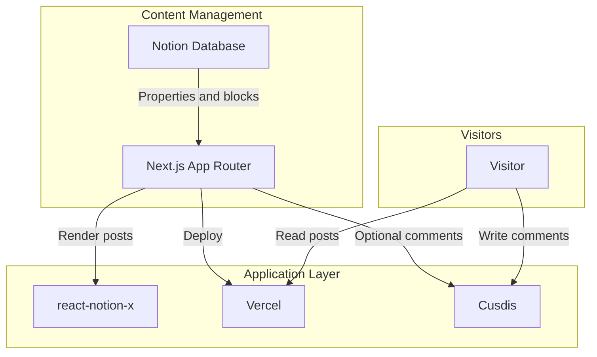

# NoLog

[](https://www.npmjs.com/package/@4lph4/nolog-core)

[Korean Version](./README_KR.md)

NoLog turns a Notion database into a Vercel-hosted blog. The project is meant to be forked from GitHub, deployed on Vercel, and operated primarily from Notion: write in Notion, publish to the web.

This service is inspired by the [morethan-log](https://github.com/morethanmin/morethan-log) project.

## Core Library (SDK)

NoLog's core Notion integration logic is separated into an independent npm library: `@4lph4/nolog-core`. This allows developers to use the NoLog engine in other frameworks like NestJS, Express, or React Native.

**Installation:**
```bash
npm install @4lph4/nolog-core
```

For detailed usage instructions, please refer to the [@4lph4/nolog-core Documentation](./packages/core/README.md).

## How It Works

NoLog uses Notion as the content source and Next.js as the presentation layer. GitHub is only needed as the source repository for Vercel deployment; post data is fetched from Notion.



## Core Services

| Service            | Role      | Purpose |
| :----------------- | :-------- | :------ |
| **Notion**         | CMS       | Manage posts, metadata, categories, tags, and status. |
| **Next.js**        | Framework | Render the blog, metadata, sitemap, OpenGraph images, and search pages. |
| **Vercel**         | Hosting   | Deploy from a GitHub fork without operating a separate server. |
| **react-notion-x** | Renderer  | Render rich Notion blocks such as callouts, toggles, tables, and code blocks. |
| **Cusdis**         | Comments  | Optional embedded comment widget. |

## Features

- **Notion CMS:** Manage posts directly in Notion.
- **Notion pagination:** Database queries follow Notion cursors, so lists keep working beyond the first 100 posts.
- **ISR-friendly fetching:** Public Notion requests use the configured revalidation interval.
- **Full block rendering:** Rich Notion pages are rendered with `react-notion-x`.
- **SEO support:** Metadata, OpenGraph images, sitemap, and robots.txt.
- **Dark mode:** Built-in light/dark theme support.
- **Responsive layout:** Desktop sidebars with a compact mobile layout.
- **Optional comments:** Cusdis comments expand with the page instead of adding a nested scroll area.

## Vercel Deployment

1. Fork this repository to your GitHub account.
2. Duplicate the [DataDashboard page](https://4lph4.notion.site/DataDashboard-35d5328064be8215ab3d81f4dbe89c08) to your Notion workspace.
3. Create a Notion integration at [notion.so/my-integrations](https://www.notion.so/my-integrations), then save the integration secret as `NOTION_TOKEN`.
4. On your duplicated database page, open `...` -> **Connections** and add the integration.
5. Turn on **Share to web** for the database page so `react-notion-x` can render page blocks.
6. Copy the database ID from the Notion database URL and save it as `NOTION_DATABASE_ID`.
7. Import your forked repository in Vercel.
8. Add the required environment variables in Vercel, then deploy.

## Environment Variables

```bash
NOTION_TOKEN="ntn_your_notion_integration_token"
NOTION_DATABASE_ID="your_notion_database_id"
NEXT_PUBLIC_CUSDIS_APP_ID="your_cusdis_app_id"
```

`NEXT_PUBLIC_CUSDIS_APP_ID` is only needed if you want to use your own Cusdis comment project.

## Local Development

```bash
npm install
npm run dev
```

Open [http://localhost:3000](http://localhost:3000) to view the blog.

## Configuration

Edit `src/site.config.ts` to customize the following:
- **Profile**: Name, bio, greeting, and avatar.
- **Template**: Choose between available templates (e.g., `default`, `terminal`).
- **Social Links**: GitHub, Twitter, etc.
- **SEO Settings**: Title, description, and keywords.
- **Site URL**: Your production domain.
- **Locale**: Language code (e.g., `ko`, `en`).
- **ISR Revalidation**: Interval for updating content.

## Templates

NoLog supports customizable website templates to change your blog's look and feel:

- **Default**: A clean, minimalist feed-based layout optimized for reading.
- **Terminal**: A retro-style, command-line interface experience.

You can learn how to create and customize your own templates in the [Template Creation Guide](docs/TEMPLATE_GUIDE.md).
