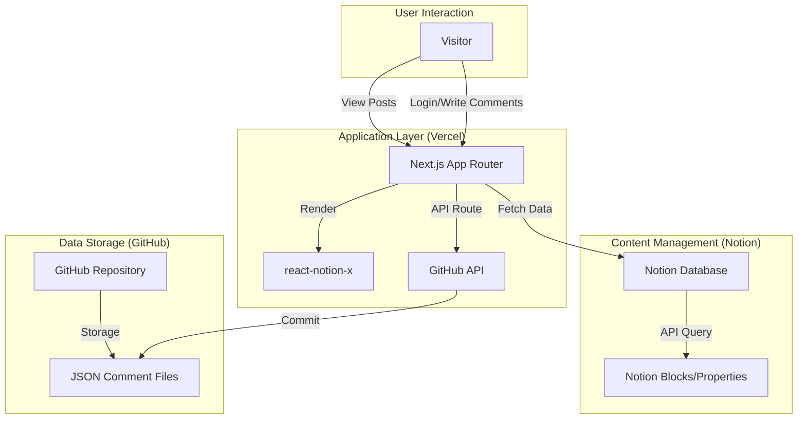

# NoLog

[🇰🇷 한국어 버전](./README_kr.md)

NoLog is a blog hosting service that turns a Notion database into a static website. It allows you to manage all your content directly in Notion and deploy it automatically via Vercel, providing a Digital Ergonomic "write in Notion, publish to web" experience.

| This service is inspired by the [morethan-log](https://github.com/morethanmin/morethan-log) project.

## 🛠 How it Works

NoLog operates on a "Headless CMS" architecture, using Notion as the content source (CMS) and Next.js as the presentation layer.

### 🏗 Architecture Diagram



### 🔋 Core Services & Reasons for Selection

| Service            | Role       | Reason for Selection                                                                                        |
| :----------------- | :--------- | :---------------------------------------------------------------------------------------------------------- |
| **Notion**         | CMS        | A powerful document creation tool. Anyone can easily manage content without technical knowledge.            |
| **Vercel**         | Hosting    | A hosting platform optimized for Next.js. You can deploy blog web pages without a separate server.          |
| **Next.js**        | Framework  | A React-based framework that provides SEO optimization, server-side rendering, and API routes.              |
| **GitHub API**     | Comment DB | Provides a "database-less" storage solution. Comments are version-controlled and hosted securely for free.  |
| **react-notion-x** | Renderer   | A renderer that accurately reproduces Notion's complex block layouts such as toggles, callouts, and tables. |

## ✨ Features

- **Notion as CMS:** Write and manage all your posts in Notion.
- **Full Block Support:** Renders Callouts, Quotes, Toggles, Bookmarks, Code blocks (with syntax highlighting), Tables, and more using `react-notion-x`.
- **SEO Optimized:** Auto-generated OpenGraph images, meta tags, sitemaps, and robots.txt.
- **Dark Mode Support:** Built-in seamless dark/light mode transition.
- **GitHub Comments:** Serverless comments stored as JSON in a GitHub repository.
- **Responsive Design:** 3-column desktop layout that gracefully falls back to a clean mobile view.

## 🚀 Getting Started (Vercel Deployment)

You can easily fork this repository to your personal GitHub account and deploy it to Vercel without writing any code locally.

### 1. Set up Notion
1. Duplicate the [DataDashboard page](https://4lph4.notion.site/DataDashboard-35d5328064be8215ab3d81f4dbe89c08) to your workspace.
2. Go to [Notion Integrations](https://www.notion.so/my-integrations) and create a new integration. Save the **Internal Integration Secret** (`NOTION_TOKEN`).
3. On your duplicated DataDashboard page, click the `...` menu -> **Connections**, and add your newly created integration.
4. Click **Share** on the top right of your Database page and turn on **Share to web** (This is required for `react-notion-x` to fetch the page blocks).
5. Extract the **Database ID** from the URL of your Notion database (the string of characters before `?v=`).

### 2. Deploy
1. **Fork** this repository to your GitHub account.
2. Go to [Vercel](https://vercel.com/) and create a new project.
3. Import your forked `nolog` repository from the "Import Git Repository" section.
4. In the **Environment Variables** section, add `NOTION_TOKEN` and `NOTION_DATABASE_ID` with their respective values.
5. Click **Deploy**!

## 💻 Local Hosting

1. Install dependencies:
```bash
npm install
```
2. Configure the `.env.local` file with the required variables, then run the development server:
```bash
NOTION_TOKEN="ntn_your_notion_integration_token"
NOTION_DATABASE_ID="your_notion_database_id"
```

```bash
npm run dev
```
3. Open [http://localhost:3000](http://localhost:3000) in your browser to view the result.

## ⚙️ Configuration
You can customize the site's profile, SEO settings, and social links by editing the `src/site.config.ts` file.

## 💬 Setting up GitHub Comments (Optional)
If you want to enable the comment system:
1. Generate a GitHub Personal Access Token (classic) with `repo` scope.
2. Add the following to your environment variables (in Vercel or `.env.local`):
   - `GITHUB_TOKEN`
   - `GITHUB_OWNER` (your GitHub username)
   - `GITHUB_REPO` (the repository where comments will be saved in the `data/comments/` path)
