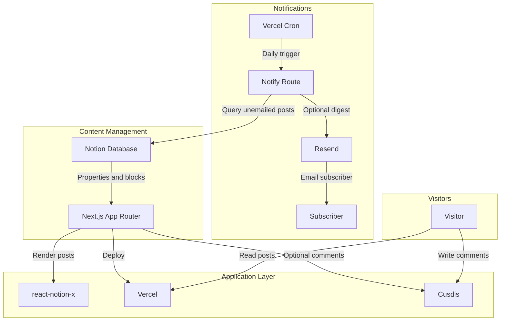

# NoLog

[](https://www.npmjs.com/package/@4lph4/nolog-core)

[Korean Version](./README_KR.md)

NoLog turns a Notion database into a Vercel-hosted blog. The project is meant to be forked from GitHub, deployed on Vercel, and operated primarily from Notion: write in Notion, publish to the web.

This service is inspired by the [morethan-log](https://github.com/morethanmin/morethan-log) project.

## Core Library (SDK)

NoLog's core Notion integration logic is separated into an independent npm library: `@4lph4/nolog-core`. This allows developers to use the NoLog engine in other frameworks like NestJS, Express, or React Native.

**Installation:**
```bash
npm install @4lph4/nolog-core
```

For detailed usage instructions, please refer to the [@4lph4/nolog-core Documentation](./packages/core/README.md).

## How It Works

NoLog uses Notion as the content source and Next.js as the presentation layer. GitHub is only needed as the source repository for Vercel deployment; post data is fetched from Notion.


```mermaid
graph TD
    subgraph "Content Management"
        N[Notion Database] -->|Properties and blocks| V[Next.js App Router]
    end

    subgraph "Application Layer"
        V -->|Render posts| RX[react-notion-x]
        V -->|Deploy| VC[Vercel]
        V -->|Optional comments| C[Cusdis]
    end

    subgraph "Notifications"
        CR[Vercel Cron] -->|Daily trigger| NR[Notify Route]
        NR -->|Query unemailed posts| N
        NR -->|Optional digest| RS[Resend]
        RS -->|Email subscriber| SUB[Subscriber]
    end

    subgraph "Visitors"
        U[Visitor] -->|Read posts| VC
        U -->|Write comments| C
    end
```

## Core Services

| Service            | Role      | Purpose |
| :----------------- | :-------- | :------ |
| **Notion**         | CMS       | Manage posts, metadata, categories, tags, and status. |
| **Next.js**        | Framework | Render the blog, metadata, sitemap, OpenGraph images, and search pages. |
| **Vercel**         | Hosting   | Deploy from a GitHub fork without operating a separate server. |
| **react-notion-x** | Renderer  | Render rich Notion blocks such as callouts, toggles, tables, and code blocks. |
| **Cusdis**         | Comments  | Optional embedded comment widget. |
| **Resend**         | Email     | Optional daily email digest for subscribers. |

## Features

- **Notion CMS:** Manage posts directly in Notion.
- **Notion pagination:** Database queries follow Notion cursors, so lists keep working beyond the first 100 posts.
- **ISR-friendly fetching:** Public Notion requests use the configured revalidation interval.
- **Full block rendering:** Rich Notion pages are rendered with `react-notion-x`.
- **SEO support:** Metadata, OpenGraph images, sitemap, and robots.txt.
- **Dark mode:** Built-in light/dark theme support.
- **Responsive layout:** Desktop sidebars with a compact mobile layout.
- **Optional comments:** Cusdis comments expand with the page instead of adding a nested scroll area.
- **Optional email digest:** Subscribers get a daily digest of newly published posts by email.

## Vercel Deployment

1. Fork this repository to your GitHub account.
2. Duplicate the [DataDashboard page](https://4lph4.notion.site/DataDashboard-35d5328064be8215ab3d81f4dbe89c08) to your Notion workspace.
3. Create a Notion integration at [notion.so/my-integrations](https://www.notion.so/my-integrations), then save the integration secret as `NOTION_TOKEN`.
4. On your duplicated database page, open `...` -> **Connections** and add the integration.
5. Turn on **Share to web** for the database page so `react-notion-x` can render page blocks.
6. Copy the database ID from the Notion database URL and save it as `NOTION_DATABASE_ID`.
7. Import your forked repository in Vercel.
8. Add the required environment variables in Vercel, then deploy.

## Email Notifications (Optional)

NoLog can email subscribers a daily digest whenever new posts go public. This feature is off by default — leave `RESEND_API_KEY` unset and nothing in this section applies.

1. Add a Checkbox property named exactly `emailed` (lowercase) to the Notion database, via Notion's new-property menu.
   **The name is case-sensitive and has no fallback key — plausible guesses like `Emailed` or `Email Sent` will not work, and the failure surfaces as `MissingEmailedPropertyError`.**
2. Open the same integration's settings at [notion.so/my-integrations](https://www.notion.so/my-integrations) and enable the **Update content** capability — this is in addition to the read access granted in step 4 of Vercel Deployment above, not a re-do of that step.
   **Skipping this does not turn the feature off — it fails silently: `markEmailed()` receives a 403 (`NotionCapabilityError`), the post is never marked as sent, and every subsequent cron run re-emails the same post to the entire audience.** This is the documented, expected failure mode per Notion's own capability model and this project's `NotionCapabilityError` class, not a claim this project has reproduced in live testing.
3. Create a Resend account and verify a sending domain by adding the SPF and DKIM DNS records Resend issues, under **Domains** in the Resend dashboard. See [Resend's domain verification guide](https://resend.com/docs/dashboard/domains/introduction).
   **Verification is mandatory: an unverified sending domain can accept a send request and report success while the email never reaches an inbox.** Verification is asynchronous — it can complete in minutes, but Resend marks a domain failed if it cannot detect the records within 72 hours.
4. Create an **Audience** in the Resend dashboard and copy its Audience ID.
5. Set `CONFIG.notify.fromAddress` in `apps/web/src/site.config.ts` to a `Name <user@your-verified-domain>` address on the domain verified in step 3. It lives in a committed config file, not an env var, because a sender identity is public branding that already appears in every message's From header — see that file's own comment for the full rationale.
   **Leaving the template author's default sender identity here, or blanking it, makes the notify route no-op — the fail-closed gate treats an unset sender as unconfigured, and nothing sends.**
6. Add the four environment variables listed below to the Vercel project.
7. Deploy. The daily digest cron is declared by the `crons` entry in `apps/web/vercel.json`; the shipped schedule is `0 11 * * *` (11:00 UTC / 8 PM KST) — edit that entry's `schedule` field to retime it for your own audience.
   **The cron fires only on Production deployments — a Preview or branch deployment never triggers it — and every schedule is evaluated in UTC, with no timezone or DST support.**

```bash
RESEND_API_KEY="re_your_resend_api_key"
RESEND_AUDIENCE_ID="your_resend_audience_id"
CRON_SECRET="your_generated_random_secret"
NOTIFY_PHYSICAL_ADDRESS="Your Name, 123 Example St, Your City, Your Country"
```

Leave these four unset and the notify route no-ops — nothing is sent; set all four to enable the daily digest. `NOTIFY_PHYSICAL_ADDRESS` is an env var, not a config field, precisely so a forker's real mailing address never enters a public fork's git history.

**Free-tier quota:** Resend's free plan includes up to 1,000 contacts/month for Audiences and Broadcasts, which is what this feature uses — that contact-list size is the actual ceiling on this feature. This is separate from the transactional Send API's 100 emails/day and 3,000/month allowance, which does not apply here, since the digest goes out through the Broadcast API against an Audience. See [Resend's pricing page](https://resend.com/docs/knowledge-base/what-is-resend-pricing) for current figures, since these are commercial terms that can change.

## Environment Variables

```bash
NOTION_TOKEN="ntn_your_notion_integration_token"
NOTION_DATABASE_ID="your_notion_database_id"
NEXT_PUBLIC_CUSDIS_APP_ID="your_cusdis_app_id"
```

`NEXT_PUBLIC_CUSDIS_APP_ID` is optional. Leave it unset to disable the comment section entirely; set it to enable comments with your own Cusdis project.

## Local Development

```bash
npm install
npm run dev
```

Open [http://localhost:3000](http://localhost:3000) to view the blog.

## Configuration

Edit `src/site.config.ts` to customize the following:
- **Profile**: Name, bio, greeting, and avatar.
- **Template**: Choose between available templates (e.g., `default`, `terminal`).
- **Social Links**: GitHub, Twitter, etc.
- **SEO Settings**: Title, description, and keywords.
- **Site URL**: Your production domain.
- **Locale**: Language code (e.g., `ko`, `en`).
- **ISR Revalidation**: Interval for updating content.

## Templates

NoLog supports customizable website templates to change your blog's look and feel:

- **Default**: A clean, minimalist feed-based layout optimized for reading.
- **Terminal**: A retro-style, command-line interface experience.

You can learn how to create and customize your own templates in the [Template Creation Guide](apps/web/docs/TEMPLATE_GUIDE.md).
