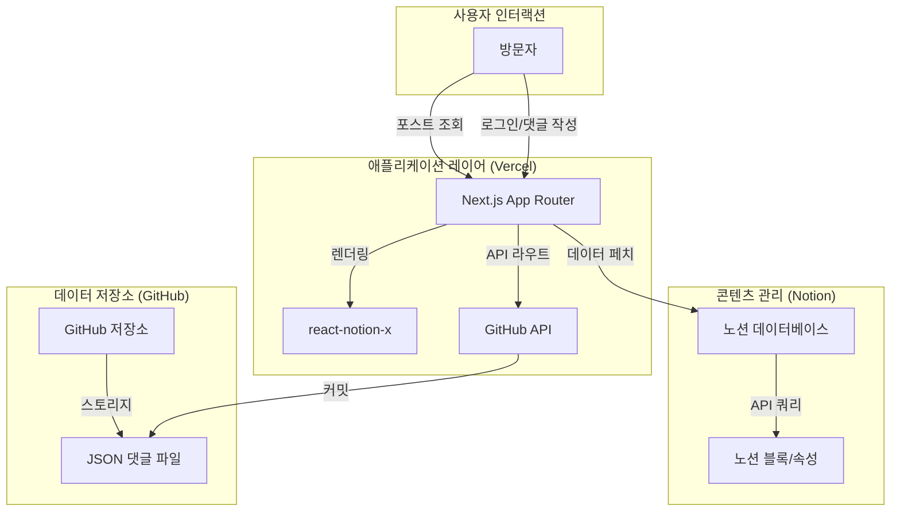

# NoLog

[🇺🇸 English Version](./README.md)

NoLog는 노션(Notion) 데이터베이스를 정적 웹사이트로 변환해주는 블로그 호스팅 서비스입니다. 모든 콘텐츠를 노션에서 직접 관리하고 Vercel을 통해 자동으로 배포하여, "노션에 쓰고, 웹에 바로 게시하는" Digital Ergonomic한 경험을 제공합니다.

| 본 서비스는 [morethan-log](https://github.com/morethanmin/morethan-log)의 프로젝트을 참고하여 제작되었습니다. 

## 🛠 작동 원리

NoLog는 노션을 콘텐츠 소스(CMS)로 사용하고 Next.js를 프리젠테이션 레이어로 사용하는 "헤드리스 CMS" 아키텍처로 동작합니다.

### 🏗 아키텍처 다이어그램



### 🔋 주요 서비스 및 선정 이유

| 서비스             | 역할       | 선정 이유                                                                                                |
| :----------------- | :--------- | :------------------------------------------------------------------------------------------------------- |
| **Notion**         | CMS        | 강력한 문서 작성 도구 입니다. 기술적인 지식 없이도 누구나 쉽게 콘텐츠를 관리할 수 있습니다.              |
| **Vercel**         | 호스팅     | Next.js에 최적화된 호스팅 플랫폼입니다. 별도의 서버 없이 블로그 웹 페이지를 배포 할 수 있습니다.         |
| **Next.js**        | 프레임워크 | SEO 최적화, 서버 사이드 렌더링, API 라우트를 제공하는 React 기반 프레임워크입니다.                       |
| **GitHub API**     | 댓글 DB    | "데이터베이스가 필요 없는" 저장 솔루션을 제공합니다. 댓글은 버전 관리되며, 무료로 안전하게 호스팅됩니다. |
| **react-notion-x** | 렌더러     | 토글, 콜아웃, 테이블 등 노션의 복잡한 블록 레이아웃을 재현하는 렌더러입니다.                             |

## ✨ 주요 기능

- **노션 CMS:** 모든 포스트를 노션에서 작성하고 관리합니다.
- **모든 블록 지원:** `react-notion-x`를 사용하여 콜아웃, 인용구, 토글, 북마크, 코드 블록(구문 강조 포함), 테이블 등을 렌더링합니다.
- **SEO 최적화:** OpenGraph 이미지, 메타 태그, 사이트맵, robots.txt를 자동으로 생성합니다.
- **다크 모드 지원:** 심리스한 다크/라이트 모드 전환 기능을 내장하고 있습니다.
- **GitHub 댓글 시스템:** GitHub 저장소에 JSON 형태로 저장되는 서버리스 댓글 시스템을 사용합니다.
- **반응형 디자인:** 데스크톱용 3단 레이아웃이 모바일 뷰에서도 깔끔하게 유지됩니다.

## 🚀 시작하기 (Vercel 배포)

본 저장소를 개인 깃허브 계정에 포크하고 Vercel에 배포할 수 있습니다.

### 1. 노션 설정
1. [DataDashboard 페이지](https://4lph4.notion.site/DataDashboard-35d5328064be8215ab3d81f4dbe89c08)를 워크스페이스로 복제합니다.
2. [노션 인티그레이션](https://www.notion.so/my-integrations)에서 새 인티그레이션을 생성하고 **Internal Integration Secret** (`NOTION_TOKEN`)을 저장합니다.
3. DatDashboard 페이지에서 `...` 메뉴 -> **연결(Connections)**을 클릭하고 새로 만든 인티그레이션을 추가합니다.
4. DATABASE 페이지 우측 상단의 **공유(Share)**를 클릭하고 **웹에 게시(Share to web)**를 활성화합니다. (`react-notion-x`가 페이지 블록을 가져오기 위해 필요합니다).
5. DATABASE의 URL에서 **데이터베이스 ID**를 추출합니다 (`?v=` 앞의 문자열).

### 2. 배포
1. 코드를 GitHub 저장소에 푸시합니다.
2. [Vercel](https://vercel.com/)로 이동하여 새로운 프로젝트 생성을 시작합니다.
3. Import Git Repository 항목에서 본인의 Repository 중 포크한 nolog 저장소를 선택합니다.
4. Environment Variables에서 NOTION_TOKEN, NOTION_DATABASE_ID을 설정합니다.   
5. 배포(Deploy) 버튼을 누릅니다!

## 💻 로컬 호스팅
1. 종속성을 설치합니다:
```bash
npm install
```
2. 필요한 변수들로 `.env.local` 파일을 설정한 후, 개발 서버를 실행합니다:
```bash
NOTION_TOKEN="ntn_your_notion_integration_token"
NOTION_DATABASE_ID="your_notion_database_id"
```

```bash
npm run dev
```
3. 브라우저에서 [http://localhost:3000](http://localhost:3000)을 열어 결과를 확인합니다.

## ⚙️ 설정 커스터마이징
`src/site.config.ts` 파일을 수정하여 사이트 프로필, SEO 설정, SNS 링크 등을 변경할 수 있습니다.

## 💬 GitHub 댓글 설정 (선택 사항)
댓글 시스템을 활성화하려면:
1. `repo` 스코프를 가진 GitHub Personal Access Token (classic)을 생성합니다.
2. 다음 환경 변수를 추가합니다:
   - `GITHUB_TOKEN`
   - `GITHUB_OWNER` (본인의 GitHub 사용자명)
   - `GITHUB_REPO` (댓글이 `data/comments/` 경로에 저장될 저장소 이름)