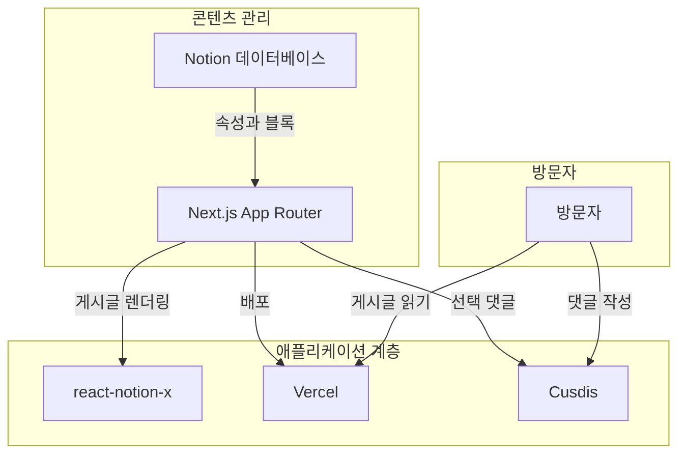

# NoLog

[English Version](./README.md)

NoLog는 Notion 데이터베이스를 Vercel에서 호스팅되는 블로그로 변환하는 프로젝트입니다. GitHub 저장소를 fork해서 Vercel에 배포하고, 실제 게시글 운영은 Notion 데이터베이스만으로 할 수 있도록 설계되어 있습니다.

이 프로젝트는 [morethan-log](https://github.com/morethanmin/morethan-log)를 참고해 제작되었습니다.

## 작동 방식

NoLog는 Notion을 콘텐츠 원천으로, Next.js를 화면 렌더링 계층으로 사용합니다. GitHub는 Vercel 배포를 위한 소스 저장소 역할만 하며, 게시글 데이터는 Notion에서 가져옵니다.



## 주요 서비스

| 서비스             | 역할      | 목적 |
| :----------------- | :-------- | :--- |
| **Notion**         | CMS       | 게시글, 메타데이터, 카테고리, 태그, 공개 상태를 관리합니다. |
| **Next.js**        | 프레임워크 | 블로그 화면, 메타데이터, 사이트맵, OpenGraph 이미지, 검색 페이지를 렌더링합니다. |
| **Vercel**         | 호스팅    | 별도 서버 운영 없이 GitHub fork 기반으로 배포합니다. |
| **react-notion-x** | 렌더러    | 콜아웃, 토글, 테이블, 코드 블록 등 Notion의 풍부한 블록을 렌더링합니다. |
| **Cusdis**         | 댓글      | 선택적으로 사용할 수 있는 임베드 댓글 위젯입니다. |

## 주요 기능

- **Notion CMS:** 게시글을 Notion에서 직접 작성하고 관리합니다.
- **Notion 페이지네이션:** Notion 쿼리 커서를 따라가므로 게시글이 100개를 넘어도 목록이 누락되지 않습니다.
- **ISR 친화적 데이터 로딩:** 공개 Notion 요청은 설정된 재검증 주기를 사용합니다.
- **Notion 블록 렌더링:** `react-notion-x`로 Notion 페이지를 풍부하게 렌더링합니다.
- **SEO 지원:** 메타데이터, OpenGraph 이미지, 사이트맵, robots.txt를 제공합니다.
- **다크 모드:** 라이트/다크 테마 전환을 지원합니다.
- **반응형 레이아웃:** 데스크톱 사이드바와 모바일 레이아웃을 제공합니다.
- **선택 댓글:** Cusdis 댓글은 별도 중첩 스크롤 없이 페이지 높이에 맞춰 확장됩니다.

## Vercel 배포

1. 이 저장소를 본인의 GitHub 계정으로 fork합니다.
2. [DataDashboard 페이지](https://4lph4.notion.site/DataDashboard-35d5328064be8215ab3d81f4dbe89c08)를 Notion 워크스페이스로 복제합니다.
3. [Notion Integrations](https://www.notion.so/my-integrations)에서 새 integration을 만들고 secret 값을 `NOTION_TOKEN`으로 저장합니다.
4. 복제한 데이터베이스 페이지에서 `...` -> **Connections**를 열고 integration을 연결합니다.
5. `react-notion-x`가 페이지 블록을 렌더링할 수 있도록 데이터베이스 페이지의 **Share to web**을 켭니다.
6. Notion 데이터베이스 URL에서 데이터베이스 ID를 복사해 `NOTION_DATABASE_ID`로 저장합니다.
7. Vercel에서 fork한 저장소를 import합니다.
8. Vercel 환경 변수에 필요한 값을 추가한 뒤 배포합니다.

## 환경 변수

```bash
NOTION_TOKEN="ntn_your_notion_integration_token"
NOTION_DATABASE_ID="your_notion_database_id"
NEXT_PUBLIC_CUSDIS_APP_ID="your_cusdis_app_id"
```

`NEXT_PUBLIC_CUSDIS_APP_ID`는 본인의 Cusdis 댓글 프로젝트를 사용할 때만 필요합니다.

## 로컬 개발

```bash
npm install
npm run dev
```

[http://localhost:3000](http://localhost:3000)을 열어 결과를 확인합니다.

## 설정

`src/site.config.ts`에서 프로필, SNS 링크, SEO 설정, 사이트 URL, locale, ISR 재검증 주기를 수정할 수 있습니다.
