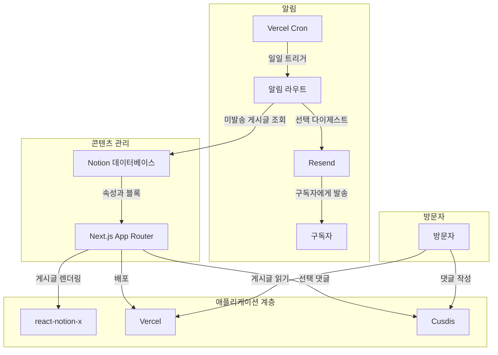

# NoLog

[](https://www.npmjs.com/package/@4lph4/nolog-core)

[English Version](./README.md)

NoLog는 Notion 데이터베이스를 Vercel에서 호스팅되는 블로그로 변환하는 프로젝트입니다. GitHub 저장소를 fork해서 Vercel에 배포하고, 실제 게시글 운영은 Notion 데이터베이스만으로 할 수 있도록 설계되어 있습니다.

이 프로젝트는 [morethan-log](https://github.com/morethanmin/morethan-log)를 참고해 제작되었습니다.

## 코어 라이브러리 (SDK)

NoLog의 핵심적인 Notion 연동 로직은 독립된 NPM 라이브러리인 `@4lph4/nolog-core`로 분리되어 있습니다. 이를 통해 개발자는 NestJS, Express, React Native 등 다른 프레임워크에서도 NoLog 엔진을 활용할 수 있습니다.

**설치 방법:**
```bash
npm install @4lph4/nolog-core
```

상세한 사용법은 [@4lph4/nolog-core 공식 문서](./packages/core/README_KR.md)를 참고해 주세요.

## 작동 방식

NoLog는 Notion을 콘텐츠 원천으로, Next.js를 화면 렌더링 계층으로 사용합니다. GitHub는 Vercel 배포를 위한 소스 저장소 역할만 하며, 게시글 데이터는 Notion에서 가져옵니다.


```mermaid
graph TD
    subgraph "콘텐츠 관리"
        N[Notion 데이터베이스] -->|속성과 블록| V[Next.js App Router]
    end

    subgraph "애플리케이션 계층"
        V -->|게시글 렌더링| RX[react-notion-x]
        V -->|배포| VC[Vercel]
        V -->|선택 댓글| C[Cusdis]
    end

    subgraph "알림"
        CR[Vercel Cron] -->|일일 트리거| NR[알림 라우트]
        NR -->|미발송 게시글 조회| N
        NR -->|선택 다이제스트| RS[Resend]
        RS -->|구독자에게 발송| SUB[구독자]
    end

    subgraph "방문자"
        U[방문자] -->|게시글 읽기| VC
        U -->|댓글 작성| C
    end
```

## 주요 서비스

| 서비스             | 역할      | 목적 |
| :----------------- | :-------- | :--- |
| **Notion**         | CMS       | 게시글, 메타데이터, 카테고리, 태그, 공개 상태를 관리합니다. |
| **Next.js**        | 프레임워크 | 블로그 화면, 메타데이터, 사이트맵, OpenGraph 이미지, 검색 페이지를 렌더링합니다. |
| **Vercel**         | 호스팅    | 별도 서버 운영 없이 GitHub fork 기반으로 배포합니다. |
| **react-notion-x** | 렌더러    | 콜아웃, 토글, 테이블, 코드 블록 등 Notion의 풍부한 블록을 렌더링합니다. |
| **Cusdis**         | 댓글      | 선택적으로 사용할 수 있는 임베드 댓글 위젯입니다. |

## 주요 기능

- **Notion CMS:** 게시글을 Notion에서 직접 작성하고 관리합니다.
- **Notion 페이지네이션:** Notion 쿼리 커서를 따라가므로 게시글이 100개를 넘어도 목록이 누락되지 않습니다.
- **ISR 친화적 데이터 로딩:** 공개 Notion 요청은 설정된 재검증 주기를 사용합니다.
- **Notion 블록 렌더링:** `react-notion-x`로 Notion 페이지를 풍부하게 렌더링합니다.
- **SEO 지원:** 메타데이터, OpenGraph 이미지, 사이트맵, robots.txt를 제공합니다.
- **다크 모드:** 라이트/다크 테마 전환을 지원합니다.
- **반응형 레이아웃:** 데스크톱 사이드바와 모바일 레이아웃을 제공합니다.
- **선택 댓글:** Cusdis 댓글은 별도 중첩 스크롤 없이 페이지 높이에 맞춰 확장됩니다.

## Vercel 배포

1. 이 저장소를 본인의 GitHub 계정으로 fork합니다.
2. [DataDashboard 페이지](https://4lph4.notion.site/DataDashboard-35d5328064be8215ab3d81f4dbe89c08)를 Notion 워크스페이스로 복제합니다.
3. [Notion Integrations](https://www.notion.so/my-integrations)에서 새 integration을 만들고 secret 값을 `NOTION_TOKEN`으로 저장합니다.
4. 복제한 데이터베이스 페이지에서 `...` -> **Connections**를 열고 integration을 연결합니다.
5. `react-notion-x`가 페이지 블록을 렌더링할 수 있도록 데이터베이스 페이지의 **Share to web**을 켭니다.
6. Notion 데이터베이스 URL에서 데이터베이스 ID를 복사해 `NOTION_DATABASE_ID`로 저장합니다.
7. Vercel에서 fork한 저장소를 import합니다.
8. Vercel 환경 변수에 필요한 값을 추가한 뒤 배포합니다.

## 이메일 알림 (선택)

NoLog는 새 게시글이 공개될 때마다 구독자에게 일일 다이제스트 이메일을 보낼 수 있습니다. 이 기능은 기본적으로 꺼져 있습니다 — `RESEND_API_KEY`를 설정하지 않으면 이 섹션의 어떤 내용도 적용되지 않습니다.

1. Notion 데이터베이스의 새 속성 메뉴에서 정확히 `emailed`(소문자)라는 이름의 Checkbox 속성을 추가합니다.
   **이름은 대소문자를 구분하며 대체 키가 없습니다 — `Emailed`나 `Email Sent`처럼 그럴듯한 다른 이름은 동작하지 않으며, 실패 시 `MissingEmailedPropertyError`가 발생합니다.**
2. 동일한 integration의 설정 페이지([notion.so/my-integrations](https://www.notion.so/my-integrations))에서 **Update content** capability를 활성화합니다 — 이는 위 Vercel 배포 4단계에서 부여한 읽기 권한과는 별개로 추가해야 하는 설정이며, 그 단계를 다시 하는 것이 아닙니다.
   **이 단계를 건너뛰어도 기능이 꺼지지 않습니다 — 조용히 실패합니다: `markEmailed()`가 403(`NotionCapabilityError`)을 받고, 게시글이 발송 완료로 표시되지 않아 이후 모든 cron 실행마다 같은 게시글이 전체 구독자에게 반복 발송됩니다.** 이는 Notion의 공식 capability 모델과 이 프로젝트의 `NotionCapabilityError` 클래스에 근거한, 문서화된 예상 실패 모드이며, 이 프로젝트가 실제로 재현해 검증한 사실이라는 뜻은 아닙니다.
3. Resend 계정을 만들고, Resend 대시보드의 **Domains**에서 Resend가 발급하는 SPF와 DKIM DNS 레코드를 추가하여 발신 도메인을 인증합니다. 자세한 절차는 [Resend의 도메인 인증 가이드](https://resend.com/docs/dashboard/domains/introduction)를 참고하세요.
   **도메인 인증은 필수입니다 — 인증되지 않은 도메인도 발송 요청을 받아들이고 성공을 반환할 수 있지만, 실제로는 받은편지함에 아무것도 도착하지 않습니다.** 인증은 비동기적으로 진행되며 몇 분 만에 끝날 수도 있지만, Resend는 72시간 내에 레코드를 감지하지 못하면 해당 도메인을 실패로 표시합니다.
4. Resend 대시보드에서 **Audience**를 생성하고 Audience ID를 복사합니다.
5. `apps/web/src/site.config.ts`의 `CONFIG.notify.fromAddress`를 3단계에서 인증한 도메인을 사용하는 `이름 <user@your-verified-domain>` 형식의 주소로 설정합니다. 발신자 정보는 모든 메일의 From 헤더에 이미 공개되는 브랜딩 정보이므로 env var가 아니라 커밋되는 설정 파일에 있습니다 — 자세한 이유는 해당 파일의 주석을 참고하세요.
   **템플릿 제작자의 기본 발신자 값을 그대로 두거나 비워두면 notify route가 아무 동작도 하지 않습니다 — fail-closed 게이트가 발신자가 설정되지 않은 것으로 간주하여 아무것도 발송하지 않습니다.**
6. 아래 네 개의 환경 변수를 Vercel 프로젝트에 추가합니다.
7. 배포합니다. 일일 다이제스트 cron은 `apps/web/vercel.json`의 `crons` 항목에 선언되어 있습니다. 기본 설정값은 `0 11 * * *`(UTC 11:00, 한국시간 오후 8시)이며, 본인의 구독자에 맞게 재설정하려면 해당 항목의 `schedule` 필드를 수정하세요.
   **cron은 Production 배포에서만 실행됩니다 — Preview나 branch 배포에서는 절대 실행되지 않습니다 — 그리고 모든 스케줄은 시간대나 DST 지원 없이 UTC 기준으로 평가됩니다.**

```bash
RESEND_API_KEY="re_your_resend_api_key"
RESEND_AUDIENCE_ID="your_resend_audience_id"
CRON_SECRET="your_generated_random_secret"
NOTIFY_PHYSICAL_ADDRESS="Your Name, 123 Example St, Your City, Your Country"
```

이 네 값을 설정하지 않으면 notify route는 아무 동작도 하지 않습니다 — 아무것도 발송되지 않습니다. 네 값을 모두 설정하면 일일 다이제스트가 활성화됩니다. `NOTIFY_PHYSICAL_ADDRESS`가 설정 파일이 아니라 env var인 이유는, 실제 주소가 공개 저장소의 git 기록에 절대 남지 않도록 하기 위해서입니다.

**무료 요금제 한도:** Resend 무료 플랜은 이 기능이 사용하는 Audience/Broadcast 기준으로 월 최대 1,000 contacts를 제공합니다 — 이 연락처 수가 이 기능의 실제 한도입니다. 이는 트랜잭션용 Send API의 하루 100통·월 3,000통 한도와는 별개이며, 이 다이제스트는 Audience 대상 Broadcast API로 발송되므로 해당 한도는 적용되지 않습니다. 최신 수치는 [Resend 요금제 안내](https://resend.com/docs/knowledge-base/what-is-resend-pricing)를 참고하세요.

## 환경 변수

```bash
NOTION_TOKEN="ntn_your_notion_integration_token"
NOTION_DATABASE_ID="your_notion_database_id"
NEXT_PUBLIC_CUSDIS_APP_ID="your_cusdis_app_id"
```

`NEXT_PUBLIC_CUSDIS_APP_ID`는 선택 사항입니다. 설정하지 않으면 댓글 섹션이 표시되지 않으며, 본인의 Cusdis 프로젝트를 사용하려면 값을 설정하세요.

## 로컬 개발

```bash
npm install
npm run dev
```

[http://localhost:3000](http://localhost:3000)을 열어 결과를 확인합니다.

## 설정

`src/site.config.ts`에서 다음 항목들을 수정하여 블로그를 커스터마이징할 수 있습니다:
- **Profile**: 이름, 소개, 인사말, 아바타 이미지.
- **Template**: 사용 가능한 템플릿 선택 (예: `default`, `terminal`).
- **Social Links**: GitHub, Twitter 등 SNS 링크.
- **SEO Settings**: 사이트 제목, 설명, 키워드.
- **Site URL**: 실제 배포될 도메인 주소.
- **Locale**: 언어 설정 (예: `ko`, `en`).
- **ISR Revalidation**: 콘텐츠 업데이트 주기 설정.

## 템플릿

NoLog는 블로그의 분위기를 바꿀 수 있는 사용자 정의 템플릿을 지원합니다:

- **Default**: 가독성에 최적화된 깔끔하고 미니멀한 피드 기반 레이아웃입니다.
- **Terminal**: 레트로한 커맨드 라인 인터페이스(CLI) 스타일의 레이아웃입니다.

나만의 템플릿을 만들고 적용하는 방법은 [템플릿 제작 가이드](apps/web/docs/TEMPLATE_GUIDE_KR.md)를 참고하세요.
